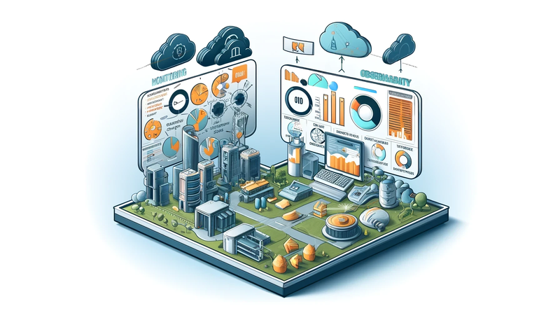
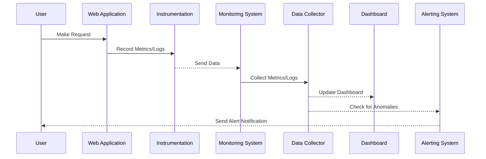

 
  

# Observability vs. Monitoring: A Comprehensive Guide from Experience

In the ever-evolving landscape of IT infrastructure, understanding the nuances between observability and monitoring is crucial. These two concepts, though related, serve distinct purposes in maintaining and optimizing system performance. Here’s a deeper dive into their differences, practical implementations, and why both are essential for modern IT operations.

## Understanding Monitoring

Monitoring involves the systematic collection and analysis of predefined metrics to track system health and performance. It is primarily reactive, focusing on detecting issues based on established thresholds and known patterns. Monitoring tools provide alerts and dashboards that help IT teams respond to anomalies and maintain system uptime. For example, monitoring can alert you when CPU usage exceeds a certain percentage or when a specific service becomes unresponsive [^fn1],[^fn2].

Traditional tools like [Nagios](https://www.nagios.org/) and [Zabbix](https://www.zabbix.com/) have long been staples in the monitoring space, providing critical data for analyzing long-term trends, building dashboards, and alerting on issues. These tools are invaluable for ensuring that known issues are caught early and managed effectively.

## The Scope of Observability

Observability extends beyond traditional monitoring by offering a more holistic view of system health. It integrates three primary data types: logs, metrics, and traces. This integration allows for a comprehensive understanding of the internal states of systems, making it possible to proactively identify potential issues and facilitate more effective root cause analysis[^fn3],[^fn4].

In practice, observability tools like ~~Lightstep~~ [ServiceNow Cloud Observability](https://www.servicenow.com/uk/products/observability.html) and the [ELK Stack](https://www.elastic.co/) (Elasticsearch, Logstash, and Kibana) have transformed how we manage and debug complex environments. These tools allow us to dive deep into the intricacies of system behavior, offering insights that go beyond what traditional monitoring can provide[^fn5].

## Key Differences

1. **Data Integration and Context**: Monitoring often deals with siloed data, which can complicate root cause analysis. Observability solutions integrate diverse data sources, providing a contextual understanding of how different system components interact and impact overall performance[^fn6],[^fn7].

2. **Flexibility**: Observability platforms allow flexible interrogation of data from multiple perspectives, which is crucial for dynamic and distributed environments like Kubernetes and multi-cloud setups. This flexibility contrasts with the more rigid nature of monitoring tools, which rely on predefined metrics and visualizations[^fn3],[^fn2].

3. **Proactive vs. Reactive**: Monitoring is inherently reactive, focusing on detecting and responding to issues. Observability, however, is proactive. It not only identifies what and when issues occur but also delves into the why and how, providing deeper insights that help prevent future problems[^fn6],[^fn5].

## Practical Implementations

In modern IT environments, the integration of monitoring and observability tools is crucial. Platforms like ServiceNow Cloud Observability, ELK Stack, and [Amazon CloudWatch](https://aws.amazon.com/cloudwatch/) offer comprehensive capabilities that integrate monitoring with advanced observability features. For instance, Lightstep provides visibility into complex deployments involving cloud, runtime, and third-party services, while ELK Stack excels at log analysis and visualization[^fn1],[^fn5].

These tools have proven to drastically reduce the time it takes to identify and resolve issues. By providing a unified view of logs, metrics, and traces, these platforms help teams pinpoint problems quickly and accurately, reducing downtime and improving overall system reliability.

## Historical Context and Evolution

Observability can be seen as an evolution of traditional application performance monitoring (APM). With the increasing complexity of IT infrastructures, APM tools have struggled to keep up, leading to the development of observability platforms that offer faster, more automated, and contextualized insights into system health[^fn3],[^fn2].

This transition from basic monitoring to advanced observability has been driven by the need to manage more complex and dynamic environments, such as microservices and multi-cloud architectures. Observability tools have become essential for providing the insights needed to maintain high levels of system performance and reliability.

## Conclusion

Both monitoring and observability are essential for modern IT management. Monitoring provides the foundational metrics and alerts necessary for basic system oversight. In contrast, observability offers the depth and context needed to proactively manage and optimize complex, distributed systems. By integrating both approaches, IT teams can ensure robust, resilient, and high-performing environments.

[^fn1]: Daniels, D. (2023). Observability vs. Monitoring: How to Differentiate? [online] Gigamon Blog. Available at: https://blog.gigamon.com/2023/01/24/how-to-differentiate-observability-vs-monitoring/ [Accessed 21 May 2024].

[^fn2]: Wilson, C. (2022). Observability vs. Monitoring: An Actual Explainer. [online] Edge Delta. Available at: https://edgedelta.com/company/blog/observability-vs-monitoring/ [Accessed 21 May 2024].

[^fn3]: IBM Blog. (2022). Observability vs. monitoring: What’s the difference? [online] Available at: https://www.ibm.com/blog/observability-vs-monitoring/ [Accessed 21 May 2024].

[^fn4]: nordlayer.com. (2024). Understanding the difference between observability and monitoring. [online] Available at: https://nordlayer.com/blog/observability-vs-monitoring/ [Accessed 21 May 2024].

[^fn5]: Slingerland, C. (2024). Observability Vs. Monitoring: The Complete Comparison. [online] cloudzero.com. Available at: https://www.cloudzero.com/blog/observability-vs-monitoring/ [Accessed 21 May 2024].

[^fn6]: Dias Generoso, T. (2023). Observability vs Monitoring - The difference explained with an example | SigNoz. [online] signoz.io. Available at: https://signoz.io/blog/observability-vs-monitoring/ [Accessed 21 May 2024].

[^fn7]: Liu, M. (2022). Observability vs. Monitoring: Everything You Need To Know. [online] DataSet Blog. Available at: https://www.dataset.com/blog/observability-vs-monitoring/ [Accessed 21 May 2024].