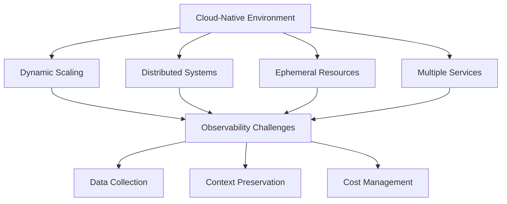
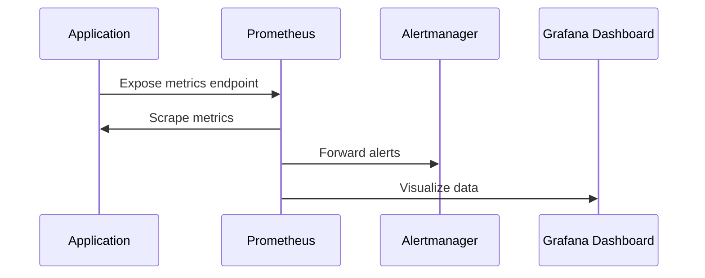
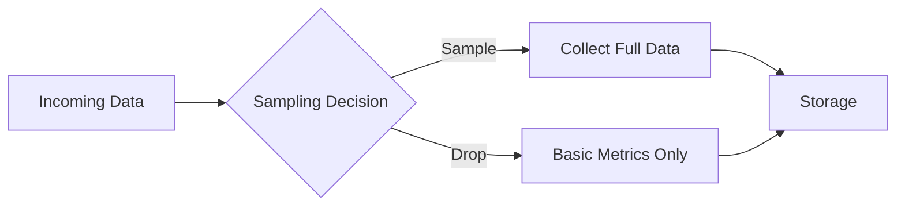
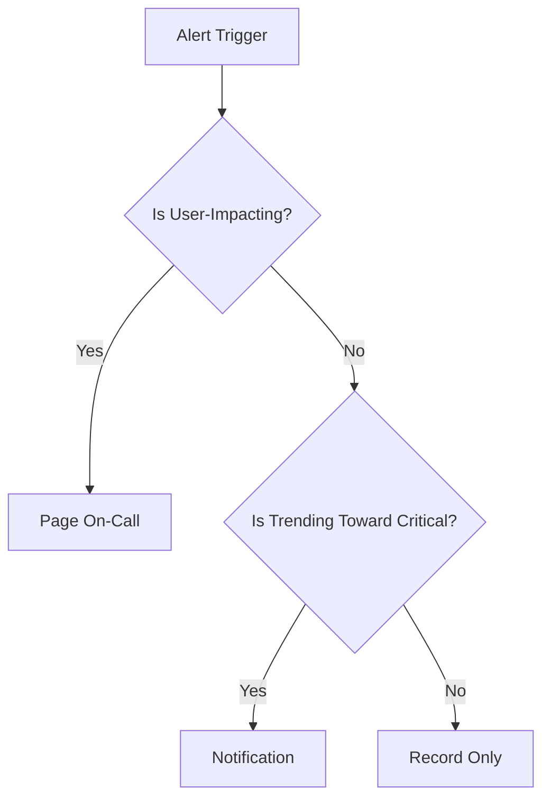

<div class="text--center"> 
  
</div>

# Implementing Cloud-Native Observability: A Practical Guide

Following our previous discussion on the differences between monitoring and observability, let's dive into the practical aspects of implementing observability in cloud-native environments. This guide will walk through real-world strategies, tools, and best practices for building observable systems in modern cloud architectures.

<!--truncate-->

## Understanding Cloud-Native Complexities

Cloud-native environments present unique challenges for observability. Let's visualize these challenges:



These challenges require a thoughtful approach to implementing the three pillars of observability.

## 1. Metrics Implementation

### Prometheus-Based Architecture

Let's look at a typical Prometheus-based metrics collection flow:



Here's an implementation example using the Prometheus client library:

```python
from prometheus_client import Counter, Histogram, start_http_server
import time

# Define metrics
REQUEST_COUNT = Counter(
    'request_total',
    'Total number of requests by status code',
    ['status_code']
)

RESPONSE_TIME = Histogram(
    'response_seconds',
    'Response time in seconds',
    buckets=[0.1, 0.5, 1.0, 2.0, 5.0]
)

# Instrument your code
def process_request(status_code=200):
    start = time.time()
    # Your business logic here
    duration = time.time() - start
    
    REQUEST_COUNT.labels(status_code=status_code).inc()
    RESPONSE_TIME.observe(duration)

# Start metrics endpoint
start_http_server(8000)
```

## 2. Structured Logging Strategy

Implement consistent structured logging across services:

```python
import structlog
import logging
from typing import Optional

logger = structlog.get_logger()

def configure_logging(service_name: str, env: str):
    structlog.configure(
        processors=[
            structlog.contextvars.merge_contextvars,
            structlog.processors.add_log_level,
            structlog.processors.TimeStamper(fmt="iso"),
            structlog.processors.JSONRenderer()
        ],
        wrapper_class=structlog.make_filtering_bound_logger(logging.INFO),
        context_class=dict,
        logger_factory=structlog.PrintLoggerFactory(),
    )

def log_event(event_name: str, trace_id: Optional[str] = None, **kwargs):
    logger.info(
        event_name,
        trace_id=trace_id,
        **kwargs
    )
```

## 3. Distributed Tracing Implementation

OpenTelemetry integration example:

```python
from opentelemetry import trace
from opentelemetry.sdk.trace import TracerProvider
from opentelemetry.sdk.trace.export import BatchSpanProcessor
from opentelemetry.exporter.otlp.proto.grpc.trace_exporter import OTLPSpanExporter

def configure_tracing(service_name: str):
    # Set up the tracer
    provider = TracerProvider()
    processor = BatchSpanProcessor(OTLPSpanExporter())
    provider.add_span_processor(processor)
    trace.set_tracer_provider(provider)
    
    return trace.get_tracer(service_name)

# Usage example
tracer = configure_tracing("payment-service")

def process_payment(payment_id: str):
    with tracer.start_as_current_span("process_payment") as span:
        span.set_attribute("payment.id", payment_id)
        # Your payment processing logic here
```

## Best Practices and Pitfalls

### 1. Data Sampling Strategies



Implement intelligent sampling:

```python
from random import random

def should_sample(trace_id: str, importance: str) -> bool:
    if importance == "high":
        return True
    
    # Hash-based sampling for consistency
    sample_rate = 0.1  # 10% sample rate
    return hash(trace_id) % 100 < (sample_rate * 100)
```

### 2. Cost Optimization

Key strategies for managing observability costs:

1. **Data Volume Management**
   - Implement aggressive sampling for high-volume, low-value data
   - Use metric aggregation for time-series data
   - Set appropriate retention policies

2. **Storage Optimization**
```python
def configure_retention_policy(data_type: str) -> int:
    retention_days = {
        "metrics": 30,
        "traces": 7,
        "logs": {
            "error": 30,
            "info": 3
        }
    }
    return retention_days.get(data_type, 7)
```

3. **Query Optimization**
   - Use materialized views for common queries
   - Implement caching for dashboard queries
   - Optimize alert queries

## Alert Design Principles



Implementation example:

```python
class AlertManager:
    def evaluate_alert(self, metric: str, value: float, threshold: float):
        # Basic threshold check
        if value > threshold:
            return self._check_alert_conditions(metric, value)
    
    def _check_alert_conditions(self, metric: str, value: float):
        # Check recent history
        history = self.get_metric_history(metric)
        if self._is_trending_up(history):
            return "urgent"
        return "warning"
```

## References and Tools

1. [OpenTelemetry Documentation](https://opentelemetry.io/docs/) - The official guide for distributed tracing implementation
2. [Prometheus Best Practices](https://prometheus.io/docs/practices/naming/) - Naming conventions and setup guides
3. [Cloud Native Computing Foundation](https://www.cncf.io/) - Resources for cloud-native observability
4. [AWS Distro for OpenTelemetry](https://aws.amazon.com/otel/) - AWS implementation of OpenTelemetry
5. [Grafana Cloud](https://grafana.com/products/cloud/) - Managed monitoring and observability platform

## Conclusion

Implementing observability in cloud-native environments requires careful consideration of tools, practices, and trade-offs. The key to success lies in:

1. Choosing appropriate tools and technologies
2. Implementing consistent instrumentation across services
3. Managing data volumes and costs effectively
4. Designing actionable alerts
5. Continuously reviewing and optimizing your observability strategy

Remember that observability is not a one-time implementation but a continuous journey of improvement and refinement. For more background on observability concepts, check out our previous post about [Monitoring vs Observability](/blog/monitoring-vs-observability).