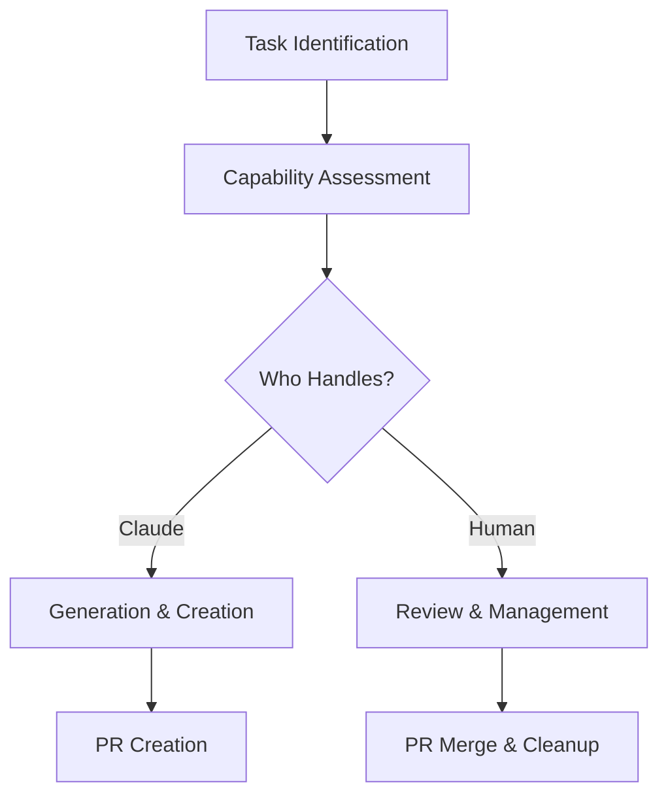

In this post, we'll explore how to use Claude Desktop with the Model Context Protocol (MCP) GitHub Server to manage repository changes effectively. We'll cover setup, capabilities, limitations, and effective pair programming strategies, using our recent implementation of AI metadata in Docusaurus as a practical example.

<!--truncate-->

## Setting Up Claude Desktop with MCP

To use Claude Desktop with the MCP GitHub Server, you'll need:

1. **Environment Setup:**
   - Claude Desktop with MCP support enabled
   - MCP GitHub Server running locally or accessible
   - GitHub repository access configured

2. **Configuration Steps:**

```yaml
# Example MCP configuration
protocol:
  version: "1.0"
  servers:
    - type: "github"
      url: "http://localhost:3000"  # or your server URL
      functions:
        - search_repositories
        - create_repository
        - get_file_contents
        - create_or_update_file
        - push_files
        - create_issue
        - create_pull_request
        - fork_repository
        - create_branch
```

3. **Function Availability:**
   - List available functions in your environment
   - Review function parameters and limitations
   - Test basic operations before complex tasks

## Understanding MCP GitHub Server

The Model Context Protocol GitHub Server provides a specific set of functions for GitHub interaction:

### Available Functions

```typescript
// Repository Operations
search_repositories(query: string)
create_repository(name: string, options?: RepoOptions)
fork_repository(owner: string, repo: string)

// File Operations
get_file_contents(owner: string, repo: string, path: string)
create_or_update_file(owner: string, repo: string, path: string, content: string)
push_files(owner: string, repo: string, files: File[])

// Branch Operations
create_branch(owner: string, repo: string, branch: string)

// Issue and PR Management
create_issue(owner: string, repo: string, title: string, body: string)
create_pull_request(owner: string, repo: string, title: string, body: string)
```

### Key Limitations
- No direct repository deletion
- No branch deletion
- No issue updates or closures
- No comment management
- No direct merge capabilities

## Effective Pair Programming with Claude

Working with Claude through MCP requires understanding the division of responsibilities:

### Claude's Role

Can Do:
- Create and plan initial structures
- Generate code and documentation
- Create issues and PRs
- Provide code reviews
- Handle file operations
- Follow repository conventions

Cannot Do:
- Merge pull requests
- Delete content
- Update or close issues
- Handle sensitive operations
- Access private repositories without setup

### Human Partner's Role

1. **Repository Management:**
   - Merge pull requests
   - Close completed issues
   - Delete branches when needed
   - Handle repository settings

2. **Quality Control:**
   - Review generated content
   - Test implementations
   - Verify security aspects
   - Validate business logic

3. **Process Management:**
   - Guide overall direction
   - Make architectural decisions
   - Handle access controls
   - Manage deployment

## Best Practices for Collaboration

1. **Clear Task Division**



2. **Communication Flow:**
   - Explicitly state task requirements
   - Define success criteria
   - Clarify any assumptions
   - Document decisions

3. **Error Prevention:**
   - Check API capabilities before operations
   - Validate generated content
   - Use descriptive commit messages
   - Document manual steps needed

## Real-World Example: AI Metadata Implementation

Let's look at how we collaborated on the AI metadata feature:

### 1. Issue Creation

```typescript
// Claude creates the issue
create_issue({
  title: "Add AI metadata components",
  body: "Detailed requirements...",
  labels: ["enhancement"],
  repo: "amiable-docusaurus",
  owner: "amiable-dev"
});

// Human reviews and refines the issue
```

### 2. Implementation Flow

```typescript
// Claude creates the branch
create_branch({
  repo: "amiable-docusaurus",
  owner: "amiable-dev",
  branch: "feature/ai-metadata-component"
});

// Claude implements components
push_files({
  files: [{
    path: "src/theme/BlogPost/Header/AIMetadata/index.tsx",
    content: "// Component implementation"
  }],
  message: "Add AI metadata component"
});

// Human reviews and provides feedback
// Claude makes adjustments based on feedback
// Human handles final merge and cleanup
```

## Common Challenges and Solutions

1. **API Limitations**
   - Challenge: Cannot update/close issues
   - Solution: Document what needs manual handling
   - Example: "These issues need manual closure: #18, #23"

2. **Work Coordination**
   - Challenge: Complex multi-step processes
   - Solution: Clear task breakdown and handoff points
   - Example: Claude creates PR, signals for review

3. **Content Management**
   - Challenge: Large file changes
   - Solution: Break into smaller, focused updates
   - Example: Component structure first, then implementation

## Workflow Tips

1. **Planning**
   - Define clear boundaries for automated vs manual tasks
   - Document required manual interventions
   - Set up clear success criteria

2. **Implementation**
   - Start with capability verification
   - Use descriptive commit messages
   - Include context in PR descriptions

3. **Review Process**
   - Human partner reviews all generated content
   - Test functionality thoroughly
   - Document any manual steps needed

## Conclusion

Effective collaboration with Claude via MCP GitHub Server requires:
1. Understanding available functions and limitations
2. Clear division of responsibilities
3. Good communication about manual steps
4. Regular validation and review

By following these practices and understanding the capabilities and limitations of both Claude and the MCP GitHub Server, teams can maintain efficient workflows while ensuring quality and security.

Our experience implementing the AI metadata feature demonstrates how this partnership can work effectively, with each party handling the tasks they're best suited for.
